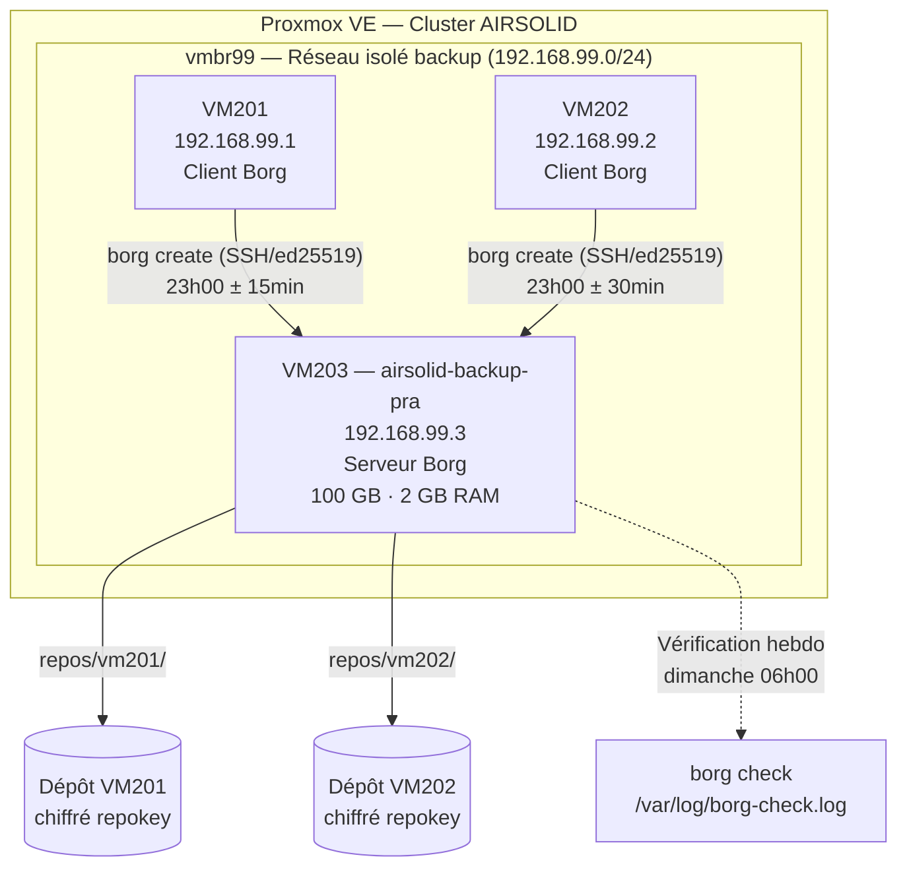
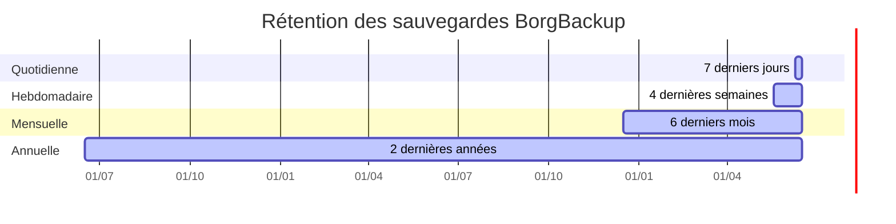

# Architecture Backup / PRA — AIRSOLID

> **Scope** : VM203 `airsolid-backup-pra` — Politique de sauvegarde des VM201 et VM202 via BorgBackup  
> **Dernière mise à jour** : 2026-06-16

---

## 1. Vue d'ensemble



---

## 2. Composants

| Composant | VMID | IP | Rôle | OS |
|---|---|---|---|---|
| airsolid-backup-pra | 203 | 192.168.99.3 | Serveur BorgBackup (dépôts) | Debian 12 |
| vm201 | 201 | 192.168.99.1 | Client BorgBackup | Debian 12 |
| vm202 | 202 | 192.168.99.2 | Client BorgBackup | Debian 12 |

**Réseau** : `vmbr99` — bridge isolé sans uplink physique. Les VMs communiquent uniquement entre elles sur ce segment.

---

## 3. Architecture BorgBackup

### 3.1 Modèle push (client → serveur)

Chaque client (VM201, VM202) :
1. Dispose d'une clé SSH `ed25519` dédiée dans `/etc/borg/id_ed25519`
2. Se connecte à l'utilisateur `borg` sur VM203 via SSH
3. Exécute `borg create` pour pousser la sauvegarde dans son dépôt dédié

Le serveur (VM203) :
- Héberge les dépôts dans `/var/backup/repos/{vm201,vm202}/`
- L'utilisateur `borg` reçoit les connexions SSH avec clé publique uniquement (pas de mot de passe)
- Chaque clé publique client peut être restreinte via `command=` dans `authorized_keys`

### 3.2 Chiffrement

| Paramètre | Valeur |
|---|---|
| Mode | `repokey` (clé AES-256 stockée dans le dépôt, protégée par passphrase) |
| Passphrase | Stockée dans `/etc/borg/passphrase` (mode 600, root uniquement) |
| Transport | SSH (chiffrement de bout en bout) |

> **Important** : sauvegarder la passphrase hors site (coffre-fort, gestionnaire de secrets). Sans elle, la restauration est impossible.

### 3.3 Compression

Algorithme `lz4` — optimisé pour la vitesse sur des données texte/binaires mixtes, impact CPU minimal.

---

## 4. Politique de rétention



| Type | Fréquence | Conservation | Commande Borg |
|---|---|---|---|
| **Quotidienne** | Toutes les nuits à 23h00 (± 30 min) | 7 jours | `--keep-daily 7` |
| **Hebdomadaire** | Dimanche (inclus dans quotidienne) | 4 semaines | `--keep-weekly 4` |
| **Mensuelle** | 1er de chaque mois (inclus) | 6 mois | `--keep-monthly 6` |
| **Annuelle** | 1er janvier (inclus) | 2 ans | `--keep-yearly 2` |

### Capacité estimée (100 GB disque VM203)

| VM | Taille estimée source | Taille backup (ratio lz4 ~60%) | × rétention max (~730 jours) | Total estimé |
|---|---|---|---|---|
| VM201 | ~10 GB | ~6 GB (incrém. ~500 MB/j) | 730 × 500 MB dédup | ~15 GB |
| VM202 | ~10 GB | ~6 GB (incrém. ~500 MB/j) | 730 × 500 MB dédup | ~15 GB |
| **Total** | | | | **~30–40 GB** (marge confortable) |

> BorgBackup utilise la déduplication par blocs (chunking BUZHASH) : les données identiques entre sauvegardes ne sont stockées qu'une fois.

---

## 5. RPO / RTO

| Indicateur | Valeur | Justification |
|---|---|---|
| **RPO** (Recovery Point Objective) | **24 heures** | Sauvegarde quotidienne à 23h00 — perte de données maximale = 1 journée de travail |
| **RTO** (Recovery Time Objective) | **4 heures** | Restauration complète d'une VM : ~1h de transfert + ~3h de reconfiguration manuelle |

### Scénarios de restauration

| Scénario | Procédure | Durée estimée |
|---|---|---|
| **Fichier perdu** | `borg mount` sur poste admin → copie ciblée | 15–30 min |
| **VM corrompue (données)** | `borg extract` → restauration des dossiers ciblés | 1–2 h |
| **VM détruite** | Nouvelle VM → OS → `borg extract` complet | 3–4 h |
| **VM203 détruite** | Recréation VM → `borg check` depuis backup des dépôts | 6–8 h |

---

## 6. Procédure d'installation

### 6.1 Prérequis

1. **Créer VM203** sur Proxmox : VMID 203, 2 GB RAM, 100 GB, bridge `vmbr99`
2. **Installer Debian 12** depuis ISO (boot manuel Proxmox) — installation minimale
3. **Configurer IP** : `192.168.99.3/24` sur l'interface réseau
4. **Accès SSH root** temporaire activé pour l'exécution Ansible

### 6.2 Déploiement Ansible

```bash
# Depuis le poste d'administration
cd ansible/backup

# 1. Configurer le serveur (VM203)
ansible-playbook -i inventory/hosts.yml site.yml --tags borg_server

# 2. Récupérer les clés publiques des clients et les ajouter sur VM203
#    (affichées en sortie du playbook client)
ansible-playbook -i inventory/hosts.yml site.yml --tags borg_client

# 3. Ajouter les clés publiques sur VM203 dans /var/backup/.ssh/authorized_keys
#    Format recommandé (restreint borg) :
#    command="borg serve --restrict-to-path /var/backup/repos/vm201",no-port-forwarding,no-X11-forwarding,no-pty ssh-ed25519 AAAA... borg-client-vm201
```

### 6.3 Premier backup test

```bash
# Sur VM201 ou VM202 — déclencher manuellement le premier backup
systemctl start borg-backup.service

# Vérifier les logs
journalctl -u borg-backup.service -f

# Lister les archives créées
BORG_RSH="ssh -i /etc/borg/id_ed25519" borg list borg@192.168.99.3:/var/backup/repos/vm201
```

### 6.4 Test de restauration (mensuel recommandé)

```bash
# Monter le dépôt en lecture seule sur VM203
mkdir -p /mnt/borg-restore
BORG_RSH="ssh -i /etc/borg/id_ed25519" \
  borg mount borg@192.168.99.3:/var/backup/repos/vm201::vm201-<DATE> /mnt/borg-restore

# Naviguer et restaurer les fichiers
ls /mnt/borg-restore/

# Démonter
borg umount /mnt/borg-restore
```

---

## 7. Surveillance et alertes

| Vérification | Fréquence | Outil | Log |
|---|---|---|---|
| Cohérence des dépôts (`borg check`) | Hebdomadaire (dimanche 06h00) | systemd timer | `/var/log/borg-check.log` |
| Succès des sauvegardes | Quotidien | systemd journal | `journalctl -u borg-backup.service` |
| Espace disque VM203 | Continu | Netdata/Grafana (VM-MON) | — |

> **Intégration future** : configurer une alerte Netdata si le disque VM203 dépasse 80 % d'utilisation, et une alerte sur échec du service `borg-backup.service` (code sortie ≠ 0).

---

## 8. Sécurité

| Mesure | Détail |
|---|---|
| Chiffrement des dépôts | AES-256 via passphrase (`repokey`) |
| Transport SSH | Clés ed25519 dédiées par client, sans mot de passe |
| Isolation réseau | vmbr99 sans uplink — aucun accès Internet depuis VM203 |
| Accès root SSH | Désactivé (clés uniquement, `prohibit-password`) |
| Passphrase | Stockée hors bande (à documenter dans le coffre-fort sécurité) |
| Accès append-only (optionnel) | `borg serve --append-only` pour empêcher la suppression d'archives par un client compromis |

---

## 9. Limites et évolutions

| Limitation actuelle | Solution future |
|---|---|
| Pas de sauvegarde hors site (VM203 sur même hôte) | Réplication vers Azure Backup ou PBS sur SRV2 |
| Monitoring basique (logs) | Intégration Borgmatic + alertes Netdata |
| Restauration manuelle | Script de restauration automatisé avec validation de hash |
| VMs Windows non couvertes | Agent BorgBackup Windows ou Veeam Agent for Windows |
